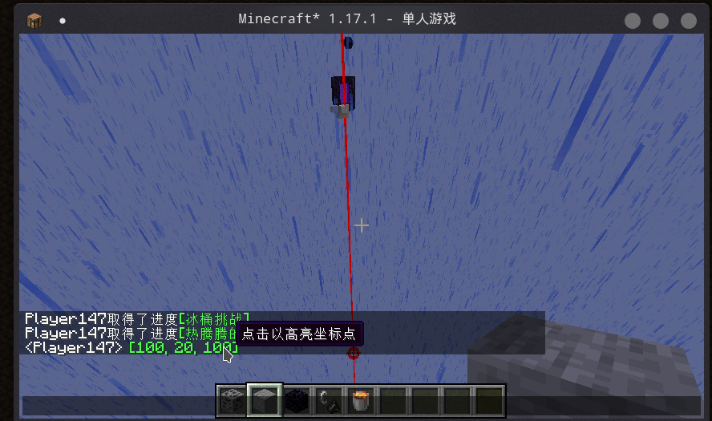

# Oh My Minecraft Client

[>>> English <<<](./README_EN.md)

Make Minecraft Client Great Again!

默认使用 O+C 打开设置界面

## 依赖

+ [malilib](https://www.curseforge.com/minecraft/mc-mods/malilib)
+ [fabric-api](https://www.curseforge.com/minecraft/mc-mods/fabric-api)

## Generic

### 不清空聊天历史记录

不清空聊天历史记录，不清空输入历史记录

### 高亮坐标点

添加了命令 `/highlightWaypoint` 来高亮坐标点

会自动解析聊天栏的坐标点（形如 `[x:1, y:2, z:3]`，`(x:1, y:2, z:3)`, `[1, 2, 3]`, `(1, 2, 3)`）

效果如下：

可用快捷键取消高亮

### 强制从聊天中解析路径点

强制从聊天中解析路径点，就算该信息中存在 click event 也会将其覆盖

### 发送当前注视的方块的坐标

发送当前注视的方块的坐标

### 整理仓库

按下快捷键后可以自动整理仓库（R 键整理的替代品）

### 整理仓库时潜影盒放在最后

整理仓库时潜影盒放在最后（指格子的最后）

### 整理仓库时支持空潜影盒堆叠

在自动整理时会将空盒视作可堆叠的

## Feature

### 自动切换鞘翅

自动切换鞘翅和胸甲（支持原地起飞）

效果如下：

### 更好的潜行

在潜行时玩家可以向下移动 1 格高

### 方块模型没有偏移

渲染方块模型时不再有随机偏移（比如凋零玫瑰）

### 禁止破坏特定方块

玩家无法破坏在 **破坏方块黑名单** 中的方块

### 禁止破坏脚手架

玩家只有在手持 **破坏脚手架白名单** 中的物品时才能破坏脚手架

### 禁止在脚手架中下降

玩家只有在手持 **在脚手架中下降白名单** 中的物品时才能在脚手架下降

### 禁止活塞推动实体

通过阻止客户端活塞推动实体（玩家除外）来减少活塞卡顿（比如地毯复制机），会导致一些实体位置渲染错误

### 强制添加破坏冷却

玩家在秒破方块后会有 5gt 的破坏冷却时间

### 高亮岩浆源

岩浆源将会使用特殊的贴图高亮

为此我们还提供了一些可选的资源包：
+ [ommc-highlightLavaSource\[32x\](static)](https://github.com/plusls/oh-my-minecraft-client/raw/1.17/docs/file/ommc-highlightLavaSource[32x](static).zip) 提供者：[Hendrix-Shen](https://github.com/Hendrix-Shen).
+ [ommc-highlightLavaSource\[32x\](dynamic)](https://github.com/plusls/oh-my-minecraft-client/raw/1.17/docs/file/ommc-highlightLavaSource[32x](dynamic).zip) 提供者：[Hendrix-Shen](https://github.com/Hendrix-Shen).
+ [ommc-xk(32x)](https://github.com/plusls/oh-my-minecraft-client/raw/1.17/docs/file/ommc-xk(32x).zip) 提供者：[SunnySlopes](https://github.com/SunnySlopes).
+ [ommc-faithful(static)](https://github.com/plusls/oh-my-minecraft-client/raw/1.17/docs/file/ommc-faithful(static).zip) 提供者：[SunnySlopes](https://github.com/SunnySlopes).
+ [ommc-faithful(dynamic)](https://github.com/plusls/oh-my-minecraft-client/raw/1.17/docs/file/ommc-faithful(dynamic).zip) 提供者：[SunnySlopes](https://github.com/SunnySlopes).

效果如下：

### 高亮流浪商人

流浪商人会像被射了光灵箭一样高亮，隐身时同样也会高亮

### 防止刻意的游戏设计

防止刻意的游戏设计（床或者重生锚爆炸）

### 防止浪费水

防止在地狱使用水桶

### 高亮不会消失的怪物

高亮不会消失的怪物（受到客户端的限制，现在只能高亮手里有特殊物品或者被命名的怪物）

### 平坦挖掘

只有在潜行时才能挖掘比自己低的方块

### 真潜行

玩家在潜行时无法上升或者下降，比如走上或者离开地毯，半砖，台阶这类方块

### 移除挖掘冷却

移除在非秒破方块后的挖掘冷却（默认是 5gt），该功能在开启 **强制添加破坏冷却** 时不会生效

### 世吞挖矿助手

当 **世吞挖矿助手白名单** 中的方块暴露在空气中时，客户端会在它们上方渲染出自己的镜像，方便世吞运维以及挖矿

## 列表

### 候选语言列表

候选语言不只是 en_us，可以设置自己的候选语言列表（比如在设置文言的时候，可以在 **候选语言列表** 中加入 zh_cn，从而在找不到语言资源的情况下使用中文文本）

## 本地服务器设置

现在可以调节如下的本地服务器设置

### 正版验证

本地服务器是否开启正版验证

### pvp

本地服务器是否允许 PVP

### 飞行

本地服务器是否允许飞行

### 局域网端口

本地服务器的局域网端口，0 表示使用随机端口

## 致谢

+ 感谢 [XeKr](https://space.bilibili.com/5930630) 的岩浆护眼材质
+ 感谢 [NextPage](https://github.com/Next-Page-Vi) 提供的英文翻译，岩浆材质修改以及测试工作
+ 感谢 [水星嗷](https://space.bilibili.com/18525909) 提供的[矿物高亮的灵感以及样例](https://www.bilibili.com/video/BV1w64y1D7wP)
+ 感谢 [voxelmap](https://www.curseforge.com/minecraft/mc-mods/voxelmap) 提供的高亮坐标点的实现
+ 感谢 [Hendrix-Shen](https://github.com/Hendrix-Shen) 提供的 32x 岩浆高亮材质
+ 感谢 [SunnySlopes](https://github.com/SunnySlopes) 提供的 32x 岩浆高亮材质
