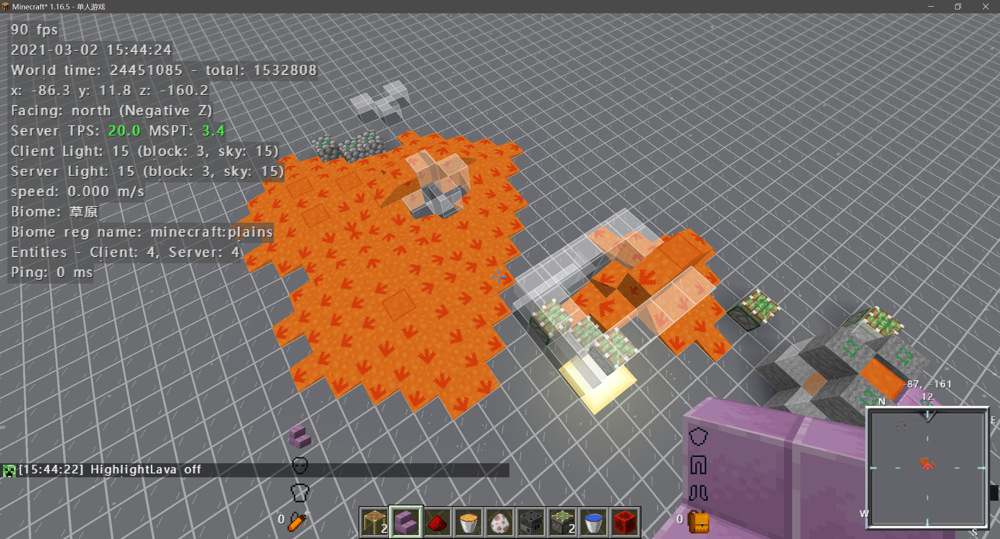
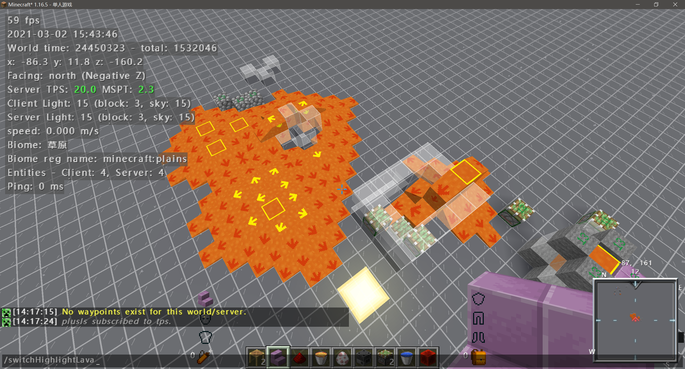
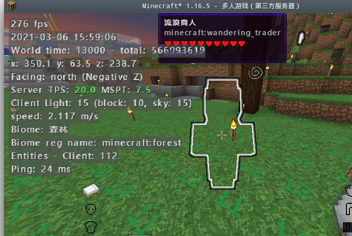
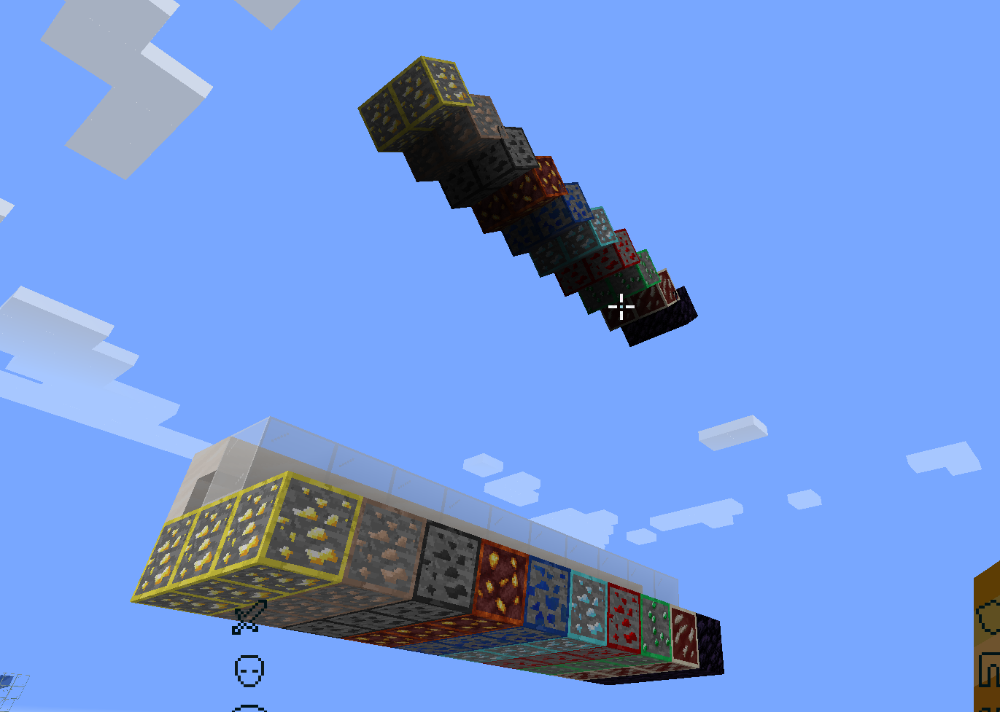

# Oh My Minecraft Client

Make Minecraft Client Great Again!

## Description
Oh My Minecraft Client is a client-side mod, which helps you manage your hands. It's written for only Fabric loader.

## NOTE: My Minecraft Client also requires the MaLiLib library mod by masady:
https://www.curseforge.com/minecraft/mc-mods/malilib

The default hotkey to open the in-game config GUI is O + C

## Feature

### Disable Break Scaffolding

Player can only break the scaffolding with the items in **breakScaffoldingWhiteList**.

### Disable Move Down In Scaffolding

Player can only move down in scaffolding when the item of **moveDownInScaffoldingWhiteList** in hand

### Forced break cooling

Players will have a 5gt cooldown after breaking the block instantaneously, which prevent you from accidentally destroying components in Haste 2 effect.

### Highlight lava source

Lava source will be highlighted with a special textures.

It looks like:

### Wandering Trader Glowing

The Wandering Trader will be glowed with the effect of Glowing, so it in Invisibility.

### Prevention of bed explosion

Prevent players from using the bed in the The Nether or The End. (Not Included Respawn anchor in Overworld!)

### worldEaterMineHelper

When the blocks in **worldEaterMineHelperWhitelist** are exposed to the air, game will render their own mirror image above them, which is convenient for world eater maintenance and mining.

## Acknowledgements

+ Thanks to [XeKr](https://space.bilibili.com/5930630) for the lava eye protection texture
+ Thanks to [NextPage](https://github.com/Next-Page-Vi) for providing English translation, lava source texture modification and testing work
+ Thanks to [水星嗷](https://space.bilibili.com/18525909) for providing [the idea of highlighting ores and resourcepack](https://www.bilibili.com/video/BV1w64y1D7wP)

## License

This template is available under the CC0 license. Feel free to learn from it and incorporate it in your own projects.
